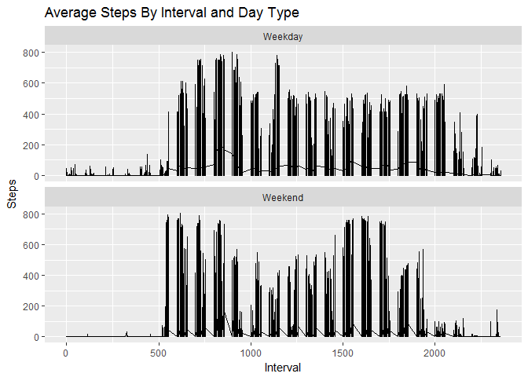

# Reproducible Research: Peer Assessment 1

## Required libraries

```r
library(ggplot2)
```

```
## Warning: package 'ggplot2' was built under R version 3.3.2
```

```r
library(knitr)
```


## Loading and preprocessing the data

```r
df <- read.csv("activity.csv")
df$date <- as.Date(df$date)
```

## What is mean total number of steps taken per day?
### Steps per day histogram

```r
stepsPerDay <- aggregate(df$steps ~ df$date, df, sum, na.rm = TRUE)
hist(stepsPerDay$`df$steps`, breaks = 10, xlab = "Steps", main = "Steps Per Day", col="#6cabe7")
```

<!-- -->

### Mean steps per day

```r
meanSteps <- mean(stepsPerDay$`df$steps`)
meanSteps
```

```
## [1] 10766.19
```

### Median steps per day

```r
medianSteps <- median(stepsPerDay$`df$steps`)
medianSteps
```

```
## [1] 10765
```

## What is the average daily activity pattern?
### Time series for interval and average steps taken, averaged across all days

```r
avgStepsPerInt <- aggregate(df$steps ~ interval, df, mean)
plot(avgStepsPerInt$interval, avgStepsPerInt$`df$steps`, type = "l", xlab="Interval", ylab = "Steps", main = "Average Steps Per Day")
```

<!-- -->

### Which 5-minute interval, on average across all the days in the dataset, contains the maximum number of steps?

```r
maxSteps <- avgStepsPerInt[avgStepsPerInt$`df$steps` == max(avgStepsPerInt$`df$steps`),]
maxSteps$interval
```

```
## [1] 835
```

## Imputing missing values
### Duplicate original data

```r
dfFull <- df
```

### Calculate total missing values

```r
missingValueCount <- sum(is.na(dfFull$steps))
missingValueCount
```

```
## [1] 2304
```

```r
missingValues <- is.na(dfFull$steps)

intervalAvg <- tapply(dfFull$steps, dfFull$interval, mean, na.rm = TRUE, simplify = TRUE)
dfFull$steps[missingValues] <- intervalAvg[as.character(dfFull$interval[missingValues])]
```

### Make histogram

```r
stepsPerDayFull <- aggregate(dfFull$steps ~ dfFull$date, dfFull, sum)
hist(stepsPerDayFull$`dfFull$steps`, breaks = 10, xlab = "Steps", main = "Steps Per Day", col="#6cabe7")
```

<!-- -->

### Mean steps per day

```r
meanStepsFull <- mean(stepsPerDayFull$`dfFull$steps`)
meanStepsFull
```

```
## [1] 10766.19
```

### Median steps per day

```r
medianStepsFull <- median(stepsPerDayFull$`dfFull$steps`)
medianStepsFull
```

```
## [1] 10766.19
```

### Impact of imputing data

```r
summary(stepsPerDay)
```

```
##     df$date              df$steps    
##  Min.   :2012-10-02   Min.   :   41  
##  1st Qu.:2012-10-16   1st Qu.: 8841  
##  Median :2012-10-29   Median :10765  
##  Mean   :2012-10-30   Mean   :10766  
##  3rd Qu.:2012-11-16   3rd Qu.:13294  
##  Max.   :2012-11-29   Max.   :21194
```

```r
summary(stepsPerDayFull)
```

```
##   dfFull$date          dfFull$steps  
##  Min.   :2012-10-01   Min.   :   41  
##  1st Qu.:2012-10-16   1st Qu.: 9819  
##  Median :2012-10-31   Median :10766  
##  Mean   :2012-10-31   Mean   :10766  
##  3rd Qu.:2012-11-15   3rd Qu.:12811  
##  Max.   :2012-11-30   Max.   :21194
```

Imputing missing data increased the first quartile of steps and decreased the third quartile.

## Are there differences in activity patterns between weekdays and weekends?

```r
dfFull$dayOfWeek <- weekdays(dfFull$date)
dfFull$dateType <- ifelse(dfFull$dayOfWeek == "Saturday" | dfFull$dayOfWeek == "Sunday", "Weekend", "Weekday")

avgStepsPerIntFull <- aggregate(dfFull$steps ~ dfFull$dateType+dfFull$interval, dfFull, mean)

plot <- ggplot(dfFull, aes(dfFull$interval, dfFull$steps)) + geom_line() + facet_wrap(~ dfFull$dateType, ncol = 1, nrow = 2) + labs(title = "Average Steps By Interval and Day Type", x = "Interval", y = "Steps")

plot
```

<!-- -->

